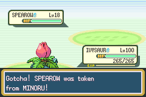
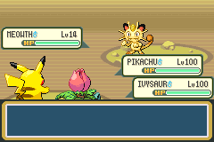
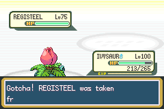
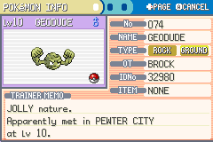

# 16. 트레이너의 포켓몬 빼앗기 — 스내그

<!--
공략집(`Thunder_Yellow_Walkthrough_v0.10.0.docx`) 16장의 원고. 옛 "알아두면 좋은 점"은 17장으로 밀린다.
docx는 tools/make_walkthrough_docx.py가 이 파일로 만든다. 주석 안은 본문에 들어가지 않고,
아래 walkthrough 블록은 표지·버전표·색인에 들어갈 줄이다. 그림은 .
근거: docs/v0.10.0-plan.md(머리말의 사용자 변경 포함), docs/team/log.md, docs/team/qa/v0.10.0-1.md.
-->
<!-- walkthrough
subtitle: 트레이너의 포켓몬 빼앗기 편
summary: v0.1.0 이벤트 20종 · 로드맵 2 이벤트 6종 · 도감 386 완성 · 호연 지역 · 갈색시티 공항 · 오 박사의 피카츄 · 로켓단 14번의 대결 · 트레이너전 스내그 · 최강을 향한 길 · 호연 1·2단계
version-row: 트레이너전 스내그: 트레이너의 포켓몬에게 볼을 던져 빼앗기(야생과 같은 확률, 경험치 없음, 전부 잡아도 승리·상금 전액), 더블 목표 고르기, 로사·로이의 나옹만 볼을 튕김, 전설도 잡힘(N의 레지스틸), 라이벌·로사·로이는 빼앗긴 계열을 다시 내지 않음
version-row: 상록시티 할아버지 힌트, 117번 도로 ISAAC 전투가 끝나지 않던 버그 수정, 상록 포켓몬센터 순경 "EGGS" 복수 문구
index-row: 모든 트레이너전 (스내그) | 상록시티 할아버지(힌트) · 보라타운 성명판정사(이름 바꾸기) · 여섯섬 물길 오두막 N(레지스틸) · 117번 도로 ISAAC · 상록 포켓몬센터 순경
-->

v0.10.0부터 **트레이너의 포켓몬에게도 볼을 던질 수 있습니다**. 원작에서는 트레이너가 볼을 쳐내며 "도둑질은 안 돼!"라고 했지만, 이제는 볼이 그대로 맞고 잡힙니다. 따로 켜는 설정은 없습니다. 전투 중 가방에서 볼을 고르면 됩니다.

## 한눈에 보기

| 항목 | 내용 |
|---|---|
| 방법 | 트레이너전에서 가방 → 볼 선택. 야생전과 같습니다 |
| 확률 | 야생과 같은 공식. 볼 종류·남은 HP·상태이상이 그대로 반영됩니다. 마스터볼은 항상 성공 |
| 잡힌 뒤 | 상대 파티에서 기절한 것처럼 빠지고, 상대는 다음 포켓몬을 냅니다. **잡은 포켓몬 몫의 경험치는 없습니다** |
| 전부 잡으면 | 보통 승리와 똑같습니다. 패배 대사, **상금 전액**, 배지·격파 기록까지 그대로 |
| 못 잡는 것 | 로사·로이의 나옹(볼이 튕기고 돌아옴). 막히는 전투 몇 가지(아래) |
| 잡은 포켓몬 | 어버이 이름 = 그 트레이너, 어버이 ID = 나. 배지와 상관없이 **항상 말을 듣습니다** |
| 재대결 | 일반 트레이너는 같은 팀 그대로. **라이벌·로사·로이**는 빼앗긴 계열을 다시 내지 않습니다 |

## 던지고 잡기까지

- **볼 소모**: 던진 볼은 야생전처럼 1개 줄어듭니다. 흔들리다 빠져나오면 볼은 사라지고 턴도 지나갑니다.
- **성공하면**: "Gotcha! (포켓몬) was taken from (트레이너)!" 한 줄과 짧은 포획 음악이 나오고, 전투곡이 처음부터 다시 흐릅니다. 새 종이면 "도감에 등록되었다" 문구가 이어집니다.
- **도감 화면·별명 입력은 건너뜁니다.** 전투가 계속되기 때문입니다. 이름은 나중에 보라타운 성명판정사에게서 바꿀 수 있습니다.
- **다음 포켓몬**: 잡힌 칸은 기절한 칸과 같이 처리됩니다. 싱글에서 "교체" 방식이면 "다음 포켓몬을 내보낸다. 바꾸겠습니까?" 질문도 평소처럼 나옵니다. 파티 공 표시에는 기절 공으로 보입니다.
- **걸려 있던 효과는 풀립니다**: 잡힌 포켓몬이 건 조이기·검은눈빛·씨뿌리기 같은 효과는 그 자리에서 사라집니다. 대타 뒤에 있어도, 변신 중이어도 원래 포켓몬으로 잡힙니다.
- **미래예지는 예외**: 잡히기 전에 쓴 미래예지는 기절한 포켓몬이 쓴 것과 같이 다음 턴에 그대로 떨어집니다.
- **일부만 잡고 나머지는 쓰러뜨려도** 보통 승리입니다. 쓰러뜨린 포켓몬 몫의 경험치만 들어옵니다.
- **잡은 뒤 지면**: 잡은 포켓몬은 그대로 내 것입니다. 트레이너는 이긴 것이 아니므로 다시 싸울 수 있습니다.
- **파티가 차 있으면** PC로 갑니다. 현재 박스가 가득하면 빈자리가 있는 다른 박스로 옮겨지고 그 사실을 알려 줍니다. 파티와 PC가 모두 가득하면 가방에서 "박스가 가득"이라고 하고 볼은 줄지 않습니다.

실측 예: 회색시티 체육관에서 웅의 꼬마돌(Lv10)에 몬스터볼을 던져 3번 빠져나오고 4번째에 잡혔습니다. 곧바로 롱스톤이 나왔습니다.

### 확률 감

| 포획률 | 예 | 몬스터볼, HP 가득 | 슈퍼볼, HP 절반 | 하이퍼볼, HP 1 | 하이퍼볼, HP 1 + 잠듦 |
|---|---|---|---|---|---|
| 45 | 롱스톤·이브이·거북왕 | 6% | 20% | 41% | 78% |
| 75 | 라이츄·윈디 | 11% | 34% | 62% | 100% |
| 120 | 냄새꼬 | 17% | 50% | 100% | 100% |
| 3 | 레지스틸 | 0% | 1% | 2% | 4% |

- HP를 깎고 재우면 관장 에이스도 하이퍼볼 1~2개로 잡힙니다. 다만 **HP를 깎는 동안 상대 트레이너는 계속 공격합니다.**
- 관장·초반 트레이너의 포켓몬은 개체값이 0인 경우가 많습니다. 레벨은 앞서도 같은 레벨의 야생 포켓몬보다 능력치가 낮습니다.

## 더블배틀 — 목표 고르기

- 상대가 둘 다 나와 있으면 볼을 고른 뒤 **목표 커서**가 뜹니다. 기술 목표를 고를 때처럼 방향키로 두 상대 사이를 오가고(고른 쪽 체력 상자가 튑니다) A로 던집니다.
- B를 누르면 볼은 가방으로 돌아가고 행동 선택으로 돌아갑니다.
- 상대가 한 마리만 남아 있으면 커서 없이 그쪽으로 던집니다.
- 같은 턴에 먼저 움직인 쪽이 목표를 잡거나 쓰러뜨렸다면, 볼은 남은 상대에게 날아갑니다.

## 잡을 수 없는 경우

### 로사·로이의 나옹

로켓단 트리오의 나옹은 팀을 떠나지 않습니다. 볼을 던지면 튕겨 나갑니다.

- 문구: "MEOWTH swatted the BALL away! It won't leave its team!" → "The BALL rolled back to you."
- **볼은 돌아옵니다.** 턴만 지나갑니다.
- 로켓단 조무래기의 나옹·페르시온은 보통 규칙대로 잡힙니다.

### 막히는 전투

아래 전투에서는 원작처럼 트레이너가 볼을 막습니다("도둑질은 안 돼!"). 볼은 소모됩니다.

| 전투 | 이유 |
|---|---|
| 통신 대전·유니온룸 | 다른 사람의 포켓몬. 원래 가방도 열 수 없습니다 |
| 트레이너 타워(세비 7섬) | 기록 시설 |
| 배틀 타워·e리더 | 원래 가방을 열 수 없습니다 |
| 오 박사 연구소의 첫 라이벌전 | 튜토리얼. 이때는 볼도 없습니다 |
| 포켓더드·상록시티 할아버지의 포획 시범 | 연출 전투 |

그 밖의 트레이너전은 모두 됩니다. 관장·사천왕·챔피언, 22번 도로 라이벌 초반전, 로켓단 14번의 대결(나옹 제외), 토너먼트, N, 은빛산 정상, 호연의 트레이너까지 포함합니다.

## 전설도 잡힌다 — N의 레지스틸

- 트레이너가 가진 전설 포켓몬도 **보통 확률로** 잡힙니다. 지금 해당하는 것은 여섯섬 물길 오두막의 N 최종전 **레지스틸**뿐입니다.
- 포획률 3이라 매우 어렵습니다. 실측에서는 하이퍼볼 5개가 모두 실패했고 마스터볼로 잡았습니다.
- **"한 플레이에 전설 한 번" 규칙의 예외입니다.** 트레이너에게서 빼앗은 레지스틸이 있어도 야생 레지스틸은 따로 만날 수 있습니다. 야생 전설은 지금처럼 보통 확률로 잡힙니다.

## 빼앗은 포켓몬

| 항목 | 값 |
|---|---|
| 개체 | 상대 그대로: 레벨·개체값·성격·성별·기술(쓴 PP까지)·잡힐 때의 HP와 상태이상·지닌 물건 |
| 볼 | 던진 볼 |
| 만난 장소·레벨 | 전투한 곳, 그때 레벨 |
| 어버이 이름 | 트레이너 이름(최대 7자). 아래 규칙 |
| 어버이 ID | 플레이어 |
| 도감 | "잡음"으로 등록 |

- **어버이 이름 규칙**: 칸토 라이벌·토너먼트 BLUE는 세이브의 라이벌 이름. 로사·로이의 포켓몬은 종에 따라 JESSIE(아보·아보크·내루미·마자용) 또는 JAMES(또가스·또도가스·모다피 계열·잉어킹·갸라도스). 쌍 트레이너는 앞사람(예: 쌍둥이 관장 TATE·LIZA → TATE). LT.SURGE는 SURGE. 그 밖에 7자를 넘으면 앞 7자(예: GIOVANNI → GIOVANN).
- **항상 말을 듣습니다.** 배지 수와 상관없습니다. 호연에서 빼앗은 높은 레벨 포켓몬도 마찬가지입니다.
- **교환 경험치 보너스는 없습니다.** 교환해 온 포켓몬처럼 "많이 받았다"가 붙지 않고, 내 포켓몬과 같은 속도로 자랍니다.
- **이름 바꾸기**: 보라타운 성명판정사가 빼앗은 포켓몬을 "내 포켓몬"으로 보고 이름을 바꿔 줍니다.
- **요약 화면 메모**: 칸토·세비에서 빼앗은 포켓몬은 트레이너 메모가 "Apparently met in (장소) at Lv N."으로 나옵니다. 원작에서 교환해 온 포켓몬에 쓰는 표현이지만 **버그가 아닙니다**. 어버이 이름이 다른 포켓몬은 이렇게 보입니다. 호연에서 만난 포켓몬도 장소가 나옵니다.
- 다른 롬으로 교환하면 보통 교환 포켓몬이 됩니다. 알을 낳게 하면 새끼의 어버이는 플레이어입니다.

## 라이벌·로사·로이는 빼앗긴 포켓몬을 다시 내지 않는다

일반 트레이너는 다시 싸우면 같은 팀으로 나옵니다(같은 개체를 또 잡을 수 있습니다). 라이벌과 로켓단 트리오는 다릅니다. 한 번 빼앗긴 **진화 계열**은 이후 모든 전투에서 파티에서 빠집니다.

| 대상 | 기록되는 계열 |
|---|---|
| 칸토 라이벌(19전)·토너먼트 BLUE | 깨비참·꼬렛·모래두지·이브이(모든 진화형)·셀러·식스테일·코일·캐이시·아라리·구구·뿔카노·가디·꼬부기의 계열 |
| 로사·로이(14전) | 아보·또가스·잉어킹·모다피·내루미·마자용의 계열 |

- **기록은 잡는 순간 됩니다.** 잡은 뒤 전투에서 져도 그 계열은 돌아오지 않습니다.
- 예: 22번 도로 초반 라이벌전에서 이브이(Lv8)를 빼앗으면, 이후 라이벌은 쥬피썬더·부스터·샤미드를 내지 않습니다.
- **라이벌은 최소 한 마리**: 모든 계열을 빼앗겨도 그 전투 파티의 마지막 칸(에이스)은 나옵니다. 이 에이스는 다시 잡을 수 있습니다.
- **나옹은 항상 남습니다.** 나머지를 모두 빼앗으면 트리오는 나옹 혼자 싱글로 싸웁니다. 나옹은 잡을 수 없으니 쓰러뜨려야 이깁니다.
- 상금과 나옹의 동전 보너스는 파티가 줄어도 표와 같습니다(15장). 파티가 줄어도 손해가 없습니다.
- 호연 라이벌(BRENDAN·MAY·WALLY)은 일반 트레이너와 같이 같은 팀 그대로입니다.

## 상록시티 할아버지의 힌트

상록시티 할아버지의 포획 시범이 끝난 뒤(시범 직후 도구를 받을 때, 그리고 다시 말을 걸 때) 한마디가 더 붙습니다.

> "Back in my day, a BALL thrown at a TRAINER's POKéMON just bounced. These days, folks say it sticks!"

옛날엔 트레이너의 포켓몬에게 던진 볼이 튕겨 나왔지만 요즘은 붙는다는 뜻입니다. 이 장의 기능을 알려 주는 힌트입니다.

## 그 밖에 달라진 것

- **117번 도로 ISAAC**: v0.8.0~v0.9.0에서 ISAAC과의 전투가 포켓몬 없이 시작되어 끝나지 않던 버그를 고쳤습니다. 이제 Lv55 포켓몬 6마리로 정상적으로 싸우고, 이기면 상금 1,540을 받습니다. 물론 그의 포켓몬도 빼앗을 수 있습니다.
- **상록 포켓몬센터 순경**: 파티와 PC가 가득해 알을 두 개 모두 맡을 때 "EGG"가 아니라 "EGGS"라고 제대로 말합니다.

세이브 호환: v0.1.0~v0.9.0 세이브를 그대로 이어서 할 수 있습니다.
