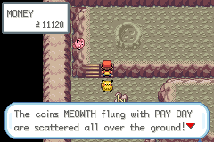
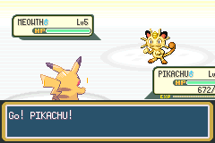
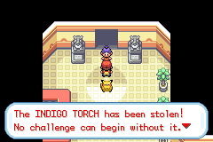
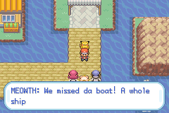
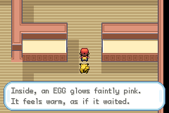
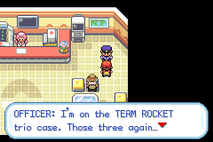

# 15. 로켓단의 역습 — 로사·로이·나옹 14번의 대결

<!--
공략집(`Thunder_Yellow_Walkthrough_v0.9.0.docx`) 15장의 원고. 옛 "알아두면 좋은 점"은 16장으로 밀린다.
docx는 tools/make_walkthrough_docx.py가 이 파일로 만든다. 주석 안은 본문에 들어가지 않고,
아래 walkthrough 블록은 표지·버전표·색인에 들어갈 줄이다. 그림은 .
-->
<!-- walkthrough
subtitle: 로켓단의 역습 편
summary: v0.1.0 이벤트 20종 · 로드맵 2 이벤트 6종 · 도감 386 완성 · 호연 지역 · 갈색시티 공항 · 오 박사의 피카츄 · 로켓단 14번의 대결 · 최강을 향한 길 · 호연 1·2단계
version-row: 로켓단의 역습: 로사·로이·나옹과 칸토 곳곳에서 14번 대결(상록 포켓몬센터 나옹전·석영고원 성화·갈색시티 항구 대체전 추가), 대결마다 진화 도구·이상한사탕 보상과 나옹의 동전, 뉴아일랜드의 뮤의 알
version-row: 상록 포켓몬센터 순경(옛 세이브 보상), 양자택일 이벤트 4곳 모두 받기, 레벨업 진화 멈춤 수정, 시작 메뉴 시계, 4번도로 기술 가르침, 크레딧 Joseph Song
index-row: 칸토 곳곳 (로켓단 14번) | 상록 포켓몬센터 나옹전 · 순경(옛 세이브 보상) · 달맞이산 B2F · 블루시티 체육관 · 상아호 / 갈색시티 항구 · 로켓단 아지트 · 포켓몬타워 · 무지개 체육관 · 실프 · 사파리 게이트 · 홍련섬 저택 · 상록 체육관(이브이 알) · 석영고원 성화 · 뉴아일랜드(뮤의 알) · 토너먼트
-->

v0.9.0부터 로사·로이·나옹은 **나타나면 반드시 싸웁니다**. 칸토를 도는 동안 모두 14번 만나고, 만날 때마다 파티가 한 마리씩 늘고 레벨이 오릅니다. 이기면 나옹이 흘린 동전과 함께 진화 도구·이상한사탕 같은 보상이 따라옵니다. 끝에는 뮤의 알이 기다립니다.

## 한눈에 보기

레벨은 트리오 파티의 최저~최고(나옹이 항상 최고). 상금은 동전 보너스까지 더한 합계입니다.

| # | 장소 | 선행 조건 | 마릿수 | 레벨 | 상금 합계 | 보상 |
|---|---|---|---|---|---|---|
| 1 | 상록 포켓몬센터 | 피카츄를 받은 직후 | 1 (싱글) | 5 | 160 | 없음(져도 이야기 진행) |
| 2 | 달맞이산 B2F | 배지 1 | 3 | 13~14 | 1,120 | 달의돌 |
| 3 | 블루시티 체육관 | 배지 2 | 3 | 20~22 | 1,760 | 신비의물방울, **물의돌** |
| 4 | 상아호 1층 복도 | 배지 2 | 4 | 15~24 | 2,112 (+조무래기 2명 1,152) | 금구슬, **이상한사탕** |
| 4' | 갈색시티 항구 (대체) | 배가 떠날 때까지 #4를 못 끝냄 | 4 | 15~24 | 2,112 | 금구슬, **이상한사탕** |
| 5 | 로켓단 아지트 B4F | 배지 3~4 | 4 | 27~30 | 2,640 | **천둥의돌** |
| 6 | 포켓몬타워 7F | 실프스코프 | 4 | 29~32 | 2,816 | **정화의부적** |
| 7 | 무지개 체육관 | 배지 4 | 4 | 31~33 | 2,904 | 기적의씨, **리프의돌** |
| 8 | 실프 11F | 배지 5 전후 | 5 | 39~42 | 4,032 | **업그레이드** |
| 9 | 연분홍 사파리 게이트 앞 | 비전머신03 | 5 | 42~45 | 4,320 | 용의이빨, **용의비늘** |
| 10 | 홍련섬 저택 앞 | 배지 7 | 5 | 47~50 | 4,800 | **이상한사탕 ×2** |
| 11 | 상록 체육관 | 배지 7 | 6 | 50~53 | 5,512 | **이상한사탕 ×3**, **이브이 알** |
| 12 | 석영고원 성화 | 배지 8 | 6 | 52~55 | 5,720 | 풀회복약, **불꽃의돌** |
| 13 | 뉴아일랜드 | 전당 등록 뒤, 밤 | 6 | 62~65 | 6,760 | CARGO TAG, **뮤의 알** (또는 이상한사탕 ×3) |
| 14 | 토너먼트 | 전당 등록 뒤 | 6 | 70~73 | 4,672 | 없음(반복 경기) |

- 굵은 글씨가 이번 판에서 새로 생긴 보상입니다.
- 5·6·7번, 8·9번은 순서를 바꿔 해도 됩니다. 7을 먼저 하면 5·6에서 우츠동이 다시 나옵니다.
- 비교로, 관장 상금은 웅 1,200 · 이슬 2,100 · 마티스 2,800 · 민화 3,200 · 독수 5,000 · 강연 5,400 · 비주기 5,500. 트리오는 늘 그 구간 관장보다 몇 레벨 아래의 "연습 상대"입니다.

## 공통 규칙

- **나옹은 언제나 나옵니다.** 파티 맨 끝, 가장 높은 레벨입니다. 진화하지 않습니다.
- **새 얼굴**: 무지개 체육관에서 우츠보트, 실프 11F에서 내루미, 상록 체육관에서 갸라도스(상아호 잉어킹의 후일담), 뉴아일랜드에서 마자용이 처음 나옵니다.
- **동전 보너스**: 이기면 나옹이 고양이돈받기로 뿌린 동전을 줍습니다. 금액은 8 × 나옹 레벨 × (마릿수 − 1). 전투 상금과 따로 들어옵니다.
- **싱글로 바뀌어도 손해 없음**: #2부터는 더블배틀입니다. 싸울 수 있는 포켓몬이 한 마리뿐이면(피카츄 혼자 다니는 경우 등) 싱글로 바뀌어 전투 상금이 절반이 되는데, 빠진 몫을 동전으로 채워 줍니다. 합계는 표와 같습니다. 단, 부적금화는 전투 상금에만 붙습니다.
- **지면 짧게 재도전**: 지면 평소처럼 마지막 포켓몬센터로 돌아갑니다. 다시 그 자리에 가면 구호 5줄을 건너뛰고 "또 왔냐" 한마디 뒤에 바로 전투합니다. 기억하는 건 마지막으로 진 한 곳뿐입니다.
  - #1은 져도 이야기가 이어지므로 재도전이 없습니다.
  - #4(상아호)는 이미 이긴 조무래기와 다시 싸우지 않습니다.
  - #12(석영고원)는 지면 석영고원 포켓몬센터에서 시작합니다. 성화를 되찾기 전에는 문지기가 사천왕 입구를 막으니, 밖으로 나가 남쪽 길을 밟으면 재도전입니다.
  - #13(뉴아일랜드)은 밤에만 가는 섬이라 재도전도 다음 밤입니다.
- **가방이 가득 차도 괜찮다**: 보상을 못 받으면 "가방이 가득"이라는 안내와 함께 **상록 포켓몬센터의 순경**이 맡아 둔다고 알려 줍니다. 가방을 비우고 순경에게 말을 걸면 맡긴 것 중 들어가는 것을 한 번에 모두 줍니다(아래 "옛 세이브 — 상록 포켓몬센터 순경"). 이브이 알·뮤의 알은 파티가 차 있으면 PC로 가고, PC 박스까지 가득 차면 역시 순경이 맡습니다.
- 달의돌(#2)은 예외입니다. 가방이 차서 못 받았으면 다음에 달맞이산에 갔을 때 삐삐가 다시 기다리고 있습니다.

## 새로 생긴 전투

### #1 상록 포켓몬센터 — 나옹 혼자

- **언제**: 오박사에게 피카츄를 받은 뒤 상록 포켓몬센터에 들어가면 정전과 함께 트리오가 들이닥칩니다.
- **전투**: 나옹 Lv5 한 마리와 싱글. 기술은 할퀴기·울음소리·고양이돈받기뿐이라 피카츄 Lv5 혼자서도 해 볼 만합니다.
- **져도 된다**: 지면 피카츄가 다시 일어나 센터의 피카츄들과 함께 반격하는 장면으로 이어집니다. 돈도 잃지 않고 흰 화면도 없습니다. 이기면 상금 160.

### #12 석영고원 — 빼앗긴 성화

- **언제**: 배지 8개를 모아 23번 도로에서 석영고원으로 올라오면, 건물 앞 외길에서 나옹이 성화를 들고 나옵니다. 외길이라 피해 갈 수 없습니다.
- **전투**: 6마리 더블(Lv52~55). 갸라도스까지 모두 나옵니다. 사천왕 직전이니 회복을 넉넉히.
- **이기면**: 성화가 제자리로 돌아오고 직원이 풀회복약과 **불꽃의돌**을 줍니다.
- **주의**: 이 대결은 사천왕 도전의 관문입니다. v0.5.0 이전에 이미 챔피언이 된 세이브도 이 트리오를 이겨야 사천왕에 다시 도전할 수 있습니다.

### #4' 갈색시티 항구 — 배를 놓친 트리오

- **언제**: 상아호에서 트리오를 이기지 못한 채 배가 떠났을 때(옛 세이브, 또는 배 안에서 지고 다시 오르지 않은 경우). 다음에 갈색시티에 오면 항구 광장으로 가는 길목(세가롤 항구·트럭 쪽)에서 나타납니다.
- **전투**: 상아호와 같은 파티·같은 상금. 조무래기 전투는 없습니다.
- **보상**: 로이가 떨어뜨린 주머니에서 금구슬과 이상한사탕.
- 배 안에서 이미 이겼다면 나오지 않습니다. 둘 중 한 번만 일어납니다.

## 곳곳의 장면

- **#2 달맞이산**: 화석과는 상관없습니다. 화석을 집든 안 집든, B2F에서 4번도로로 올라가는 사다리 앞 길목을 지나면 삐삐를 노리는 트리오와 마주칩니다. 화석을 먼저 집었다면 그 자리에서 이전처럼 나타납니다. 이기면 삐삐가 달의돌을 주고, 그 뒤로는 다시 나오지 않습니다.
  - 화석을 지나쳐 이미 달맞이산을 빠져나간 옛 세이브도 다음에 4번도로 쪽에서 B2F로 돌아오면 같은 길목에서 만납니다.
  - 이긴 뒤 화석을 집어도 트리오가 다시 나오지 않습니다.
- **#3 블루시티 체육관**: 물 쇼 습격. 이슬이 신비의물방울에 이어 **물의돌**을 줍니다.
- **#5 로켓단 아지트**: 트리오가 날아간 뒤 무언가 굴러떨어집니다. **천둥의돌**. 스타팅 피카츄를 데리고 있으면 피카츄가 고개를 젓습니다(오박사의 피카츄는 진화를 싫어합니다). 돌은 그대로 받으니 다른 피카츄나 이브이에 쓰면 됩니다.
- **#6 포켓몬타워**: 유령 장난 끝에 트리오가 **정화의부적**을 두고 갑니다.
- **#11 상록 체육관**: 함정 바닥을 지나면 트리오가 체육관을 차지하고 있습니다. 이기면 두고 간 자루에서 **이상한사탕 ×3**과 **이브이 알**이 나오고, 돌아온 비주기가 "가져가라"고 합니다. 이브이 알은 약 8,900걸음에 부화하고 Lv5로 태어납니다.

## 뮤의 알 (#13 뉴아일랜드)

- **조건**: 전당 등록 뒤 밤에 뉴아일랜드로 가서 트리오를 이깁니다.
- **분기**:

| 갈색시티 트럭 밑의 뮤 | 받는 것 |
|---|---|
| 아직 만나지 않았다 | 인큐베이터 속 **뮤의 알** |
| 이미 싸웠다(잡았든 쓰러뜨렸든) | 빈 알껍데기 옆의 **이상한사탕 ×3** |

- **부화**: 약 **10,200걸음**. Lv5로 태어납니다. 이 뮤는 "운명적인 만남"으로 기록되어 전투에서 말을 잘 듣습니다. 파티가 차서 PC로 가도 마찬가지입니다.
- **한 플레이에 뮤는 하나**: 알을 받으면 트럭 밑 뮤는 떠나고 분홍 털만 남습니다. 트럭 뮤와 알은 둘 중 하나만 얻습니다.

## 옛 세이브 — 상록 포켓몬센터 순경

- **장소**: 상록 포켓몬센터 오른쪽 위 구석. #1을 끝낸 뒤부터 서 있습니다.
- **하는 일**: 이미 끝낸 로켓단 대결 중 아직 못 받은 새 보상을 한 번에 모두 줍니다. 가방이 차서 맡겨 둔 보상도 여기서 받습니다. 받은 것은 한 줄 목록으로 한꺼번에 나옵니다(같은 도구는 합쳐서, 예: "이상한사탕 ×6").
  - 예: #1~#13을 모두 끝낸 옛 세이브라면 물의돌·천둥의돌·정화의부적·리프의돌·업그레이드·용의비늘·불꽃의돌·이상한사탕 6개(1+2+3), 이브이 알, 그리고 트럭 뮤를 만나지 않았다면 뮤의 알(아니면 이상한사탕 3개 더).
- **들어가는 것은 전부, 못 준 것만 보관**: 가방에 들어가는 도구, 파티나 PC 박스에 들어가는 알은 모두 주고, 자리가 없는 것만 순경이 맡아 둡니다. 무엇이 가득했는지도 알려 줍니다 — "가방이 가득하다"(도구), "파티와 PC 박스가 가득하다"(알). 알이 PC로 가면 그 사실도 한 줄로 알려 줍니다.
- **맡긴 것 찾기**: 가방이나 박스를 비우고 다시 말을 걸면 남은 것만 줍니다. 이미 받은 것을 두 번 주지는 않습니다. 더 줄 것이 없으면 "새로 들어온 것이 없다"고만 합니다.
- 동전 보너스와 경험치는 소급하지 않습니다. #1·#12를 이미 지난 세이브에서는 새 전투가 다시 일어나지 않습니다(#12의 불꽃의돌은 순경이 줍니다).

## 그 밖에 달라진 것

- **진화 멈춤 수정**: 레벨이 올라도 진화하지 않던 포켓몬이 있던 버그를 고쳤습니다(예: 개무소 → 카스쿤). 이상한사탕으로 올려도, 전투로 올려도 진화합니다.
- **피카츄와 천둥의돌**: 진화를 거부하는 건 **오박사에게 받은 스타팅 피카츄뿐**입니다. 야생이나 알에서 얻은 피카츄는 천둥의돌로 라이츄가 됩니다.
- **시계**: 시작 메뉴 왼쪽 위에 요일·시각·낮밤이 표시됩니다(예: "SUN 10:03 / DAY"). 포켓워치로 시각을 보고 바꿀 수도 있습니다.
- **양자택일은 이제 전부**: 둘 중 하나를 고르던 이벤트 4곳에서 둘 다 받습니다.

| 이벤트 | 받는 것 |
|---|---|
| 노랑시티 격투도장 | 시라소몬·홍수몬 둘 다 |
| 달맞이산 MIGUEL | 조개화석·투구화석 둘 다 |
| STERN의 심해 도구 | 심해의이빨·심해의비늘 둘 다 |
| 트릭하우스 최종 상품 | 부적금화·학습장치 둘 다 |

  - 화석을 하나만 받고 떠난 옛 세이브는 달맞이산 B2F에 다시 가면 남은 화석이 제자리에 있습니다. 홍련섬 연구소에서 두 화석 모두 복원할 수 있습니다.
  - 그래서 홍련섬 트리오의 보상은 "고르지 않은 화석" 대신 **이상한사탕 ×2**입니다.
- **4번도로 기술 가르침**: 메가톤펀치·메가톤킥을 둘 다, 원하는 만큼 여러 포켓몬에게 가르쳐 줍니다.
- **엔딩 크레딧**: 스태프 명단 맨 끝에 **Joseph Song** 페이지가 새로 들어갔습니다. 앞 페이지들을 조금씩 줄여 THE END가 나오는 시점은 v0.8.0과 같습니다.

세이브 호환: v0.1.0~v0.8.0 세이브를 그대로 이어서 할 수 있습니다.
